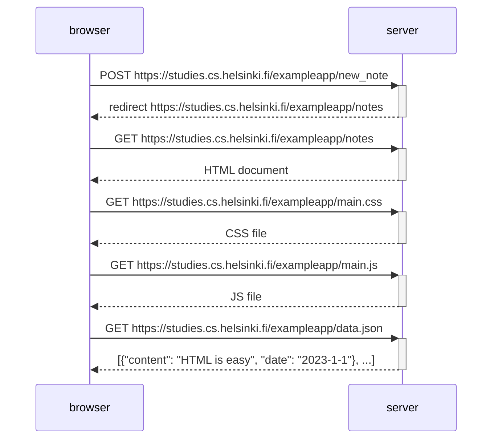

```mermaid
sequenceDiagram
    browser->>+server: POST https://studies.cs.helsinki.fi/exampleapp/new_note
    server-->>-browser: redirect https://studies.cs.helsinki.fi/exampleapp/notes
    browser->>+server: GET https://studies.cs.helsinki.fi/exampleapp/notes
    server-->>-browser: HTML document
    browser->>+server: GET https://studies.cs.helsinki.fi/exampleapp/main.css
    server-->>-browser: CSS file
    browser->>+server: GET https://studies.cs.helsinki.fi/exampleapp/main.js
    server-->>-browser: JS file
    browser->>+server: GET https://studies.cs.helsinki.fi/exampleapp/data.json
    server-->>-browser: [{"content": "HTML is easy", "date": "2023-1-1"}, ...]
```
